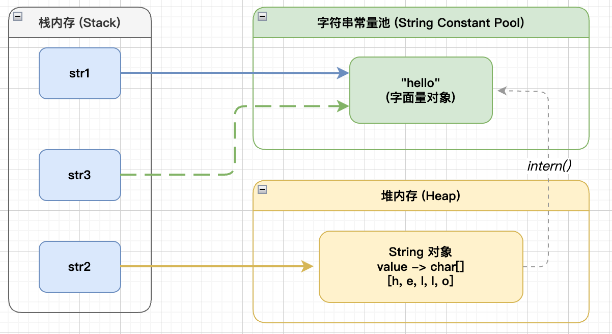

关于标题，是来自 Twitter (现 X) 工程师对 String 的一个经典优化场景：Twitter 每次发布消息状态的时候，都会产⽣⼀个地址信息，代码如下，以当时 Twitter ⽤户的规模预估，服务器需要`32G`的内存来存储地址信息。

```java
public class Location {
    private String city;
    private String region;
    private String country;
    private double longitude;
    private double latitude;
}
```

考虑到会有多个用户来自相同地区，因此可以将地区信息单独列出，减少重复：

```java
public class SharedLocation {
    private String city;
    private String region;
    private String country;
}

public class Location {
    private SharedLocation location;
    private double longitude;
    private double latitude;
}
```

通过优化，数据存储⼤⼩减到了`20G`左右。但对于内存存储这个数据来说，依然很⼤。最终经过 Twitter 程序员的优化，将这 20G 降低到了几百M，那他们是如何做到的呢？

## String 是如何实现的？

### Java6: 共享 char []

随着 Java 版本迭代，String 对象的实现方式也经过了若干优化。在 Java6 及之前的版本中，String 对象是对 char 数组的封装，主要包含四个成员变量：

```java
public final class String implements java.io.Serializable, Comparable<String>, CharSequence
{
    /** The value is used for character storage. */
    private final char value[];

    /** The offset is the first index of the storage that is used. */
    private final int offset;

    /** The count is the number of characters in the String. */
    private final int count;

    /** Cache the hash code for the string */
    private int hash;
}
```

- value ：char 类型数组，负责真正存储字符数据；
- offset：表哦是当前字符串在 value 数组中的起始位置；
- count：表示字符串长度
- hash：哈希值

此版本中，String 对象通过 offset 和 count 两个属性来定位 char 数组中的元素，但这种方式可能会导致内存泄露，我们来看一下 substring 方法的源码：

```java
public String substring(int beginIndex, int endIndex) {
  	/** .....省略若干判断 */
    return ((beginIndex == 0) && (endIndex == count)) ?
        this :
        new String(offset + beginIndex,
                   endIndex - beginIndex,
                   value);
}

// java6 中的构造器
String(int offset, int count, char value[]) {
    this.value = value;
    this.offset = offset;
    this.count = count;
}
```

可以看到，new String 并没有复制字符数组，而是共用了同一个 char 数组，只修改了 offset 和 count，可以看一个例子：

```java
String str = "HelloWorld";
String sub = str.substring(5);
```

```
str
 ├─ value -> ['H','e','l','l','o','W','o','r','l','d']
 ├─ offset = 0
 └─ count = 10

sub
 ├─ value -> 同一个char[]
 ├─ offset = 5
 └─ count = 5
```

不难发现，假如 str 是一个巨大无比的 String 对象，而我们调用了 str.substring(999999)，最终我们想要的只是这一个字符，但前面999999 个字符占用的内存空间始终无法被释放。

### Java7: 解决 substring 问题

从 Java7 开始到我们最常用的 Java8，offset 和 count 被删除，只保留了 char 数组和 hash 哈希值。String 对象占用的内存稍微少了些的同时，substring 方法也不再共享 char，从而解决了 Java6 中经典的内存泄露问题。

```java
public final class String
    implements Serializable, Comparable<String>, CharSequence {

    /** 用于存储字符 */
    private final char[] value;

    /** hash缓存 */
    private int hash;
}

public String substring(int beginIndex, int endIndex) {

    int subLen = endIndex - beginIndex;

    return ((beginIndex == 0) && (endIndex == value.length))
        ? this
        : new String(value, beginIndex, subLen);
}
// 不再共享 char 数组
public String(char value[], int offset, int count) {
    this.value = Arrays.copyOfRange(
                    value,
                    offset,
                    offset + count);
}
```

> Java 社区通常称之为 substring 引起的「内存泄露」，更准确地说，这是由于共享底层字符数组导致的大对象长期无法被 GC 回收。

### Java9: Compact String

Java 9 开始，String 的实现发生了自 JDK 1.0 以来最大的一次变化：**Compact Strings（紧凑字符串）**，核心字段变成：

```java
public final class String {

    private final byte[] value;

    private final byte coder;

    private int hash;
}
```

我们知道一个 char 占 2 字节(16 bits)，如果我们存储的内容只包含 ASCII 字符(每个字符只占一个字节)，就相当于浪费了一半的内存。为了节省空间，Java9使用了占 8bit 的 byte 数组来存放字符串，coder 属性的作用用来表示字符编码，0代表 Latin-1 单字节编码，1 代表 UTF-16

## String 对象的不可变性——字符串常量池

大体了解了 String 对象的实现原理之后，你发现现了 String类被 final 关键字修饰了，而且成员变量 char 数组也被 final 修饰了。类被 final 修饰后不可继承，而 char 被 final 与 private 关键字修饰，代表了 String 对象不可更改，所以 String 对象一旦成功创建，就不能再对他进行修改，这就是 String 对象的不可变性。

> 通过反射等特殊手段修改 String 不在本文讨论范围内

所以 String 对象就是因为 char 数组被 final 修饰了所以才有不可变性的吗？


**是，但不完全是**。String 的不可变性并不是 final 关键字带来的，而是 String 类自身的设计保证的：

用 final 修饰 char 数组，数组确实不能被修改，但是这里指的是引用地址不可被修改，我们不能把 value 指向另一个地址，并不代表存储在堆里的这个数组本身的内容不可变，例如：

```java
final int[] value = {1,2,3};
int[] newValue = {4,5,6};
value =newValue;
```

在 idea 中输入这段代码，编译器会提示我们 `Cannot assign a value to final variable 'value'`，但如果我们直接通过 `value[1] = 9;` 修改数组中的元素，这是完全没问题的。所以我们讨论 String 对象不可变的时候，不能仅从 final 关键字出发。如果你看过 String 相关源码，你会发现 String 的所有方法里，都避免去修改 char 数组中的数据，涉及 char 数据的修改都会重新创建一个 String 对象。那 Java 的作者为什么需要这样做呢？

### 字符串常量池

其实，我们在用双引号定义一个 String 对象时，创建的是一个**字符串字面量**，由 jdk 的 native 代码创建，它是一种在程序中直接表示字符串值的方式，编译器可以直接识别这种表示形式。Java 对字符串常量值做了优化，将其专门存放在**字符串常量池(String Constant Pool)**中。JDK7 之后，是存储在堆中的一块特殊区域。它的主要目的是优化字符串的存储，避免相同字符串的重复创建，从而节省内存空间。

创建字符串常量时，JVM 会先检查字符串常量池，如果池中存在相同内容的字符串，就直接返回该字符串的引用；如果不存在，就会在池中创建一个新的字符串对象，并返回该对象的引用。这样就不难理解为什么 String 必须设计成不可变对象

```java
String str1 = "hello";
String str2 = "hello";

System.out.println(str1 == str2) // true
```

str1 与 str2 共用同一个 String 对象，假设 String 对象可以被修改，那么我们修改 str2，str1 的内容也会随之变化，这显然不是想要的结果。

## String 对象的优化

### 字符串创建优化

讨论字符串的创建，这里有一个经典的面试题，问最终输出结果：

```java
String str1 = "hello";
String str2 = new String("hello");
String str3 = str2.intern();
System.out.println(str1 == str2);
System.out.println(str1 == str3);
System.out.println(str2 == str3);
```

创建字符串常量，默认会将对象放⼊常量池；创建字符串变量，对象是会创建在堆内存中，同时也
会在常量池中创建⼀个字符串对象，String对象中的char数组将会引⽤常量池中的char数组，并返
回堆内存对象引⽤。如果调用 intern 方法，会先查找字符串常量池中是否有相同字符串，如果没有，会把字符串添加到字符串常量池中；如果有，就返回常量池中的字符串引用。因此，上述代码中三者在内存中的关系应是如此：



上述代码执行结果应该是

```java
false
true
false
```

回到标题，Twitter 工程师的做法是，使用 String.intern 来节省内存，具体做法就是，在每次赋值的时候使⽤String的intern⽅法，如果常量池中有相同值，就会重复使⽤
该对象，返回对象引⽤，这样⼀开始的对象就可以被回收掉。

```java
SharedLocation sharedLocation = new SharedLocation();
sharedLocation.setCity(messageInfo.getCity().intern());
sharedLocation.setCountryCode(messageInfo.getRegion().intern());
sharedLocation.setRegion(messageInfo.getCountryCode().intern());
Location location = new Location();
location.set(sharedLocation);
location.set(messageInfo.getLongitude());
location.set(messageInfo.getLatitude());
```

关于内存回收，最后再补充一点：

```java
String a =new String("abc").intern();
String b = new String("abc").intern();
// a==b?
```

这里 a==b 会返回什么呢？

- 创建a变量时，调⽤new Sting()会在堆内存中创建⼀个String对象，String对象中的char数组将会引
  ⽤常量池中字符串。在调⽤intern⽅法之后，会去常量池中查找是否有等于该字符串对象的引⽤，有就返回引⽤;
- 创建b变量时，调⽤new Sting()会在堆内存中创建⼀个String对象，String对象中的char数组将会引
  ⽤常量池中字符串。在调⽤intern⽅法之后，会去常量池中查找是否有等于该字符串对象的引⽤，有就返回引⽤。⽽在堆内存中的两个对象，**由于没有引⽤指向它，将会被垃圾回收**。所以a和b引⽤的是同⼀个对象。

> - 使用 intern 也需要结合实际场景，因为常量池的实现类似一个 HashTable，数据越多，遍历需要的时间越长，所以数据量过大时使用 intern 创建字符串会变慢。
> - 从 JDK7 开始，intern() 不再复制字符串，而是直接把首次出现的字符串引用放入字符串常量池，因此效率相比早期版本更高。

### 字符串拼接优化

在实际工作中，字符串的拼接非常常见，前面我们讨论了 String 对象的不可变性，如果我们手动拼接字符串会发生什么呢？

```java
String str = "Hello" + "," + "World";
```

理论上，首先会生成"Hello"对象，再生成 "Hello, "，最后生成 "Hello, World"，短短一个拼接，会产生三个 String 对象，这显然是低效的

实际上，编译器会自动优化，直接创建一个 "Hello, World"：

```java
String str = "Hello,World";
```

字符串变量的累加又是怎样的呢？

```java
String str = "hello";
for (int i=0; i<100; i++) {
    str = str + i;
}
```

利用 `javap` 反编译一下：

```java
public static void main(java.lang.String[]);
    Code:
       0: ldc           #2                  // String hello
       2: astore_1
       3: iconst_0
       4: istore_2
       5: iload_2
       6: bipush        100
       8: if_icmpge     36
      11: new           #3                  // class java/lang/StringBuilder
      14: dup
      15: invokespecial #4                  // Method java/lang/StringBuilder."<init>":()V
      18: aload_1
      19: invokevirtual #5                  // Method java/lang/StringBuilder.append:(Ljava/lang/String;)Ljava/lang/StringBuilder;
      22: iload_2
      23: invokevirtual #6                  // Method java/lang/StringBuilder.append:(I)Ljava/lang/StringBuilder;
      26: invokevirtual #7                  // Method java/lang/StringBuilder.toString:()Ljava/lang/String;
      29: astore_1
      30: iinc          2, 1
      33: goto          5
      36: getstatic     #8                  // Field java/lang/System.out:Ljava/io/PrintStream;
      39: aload_1
      40: invokevirtual #9                  // Method java/io/PrintStream.println:(Ljava/lang/String;)V
      43: return
```

再把这段字节码还原一下：

```java
public static void main(String[] args) {
    String str = "hello";
    int i = 0;

    while (true) {
        if (i >= 100) {
            break;
        }

        str = new StringBuilder()
                .append(str)
                .append(i)
                .toString();

        i++;
    }

    System.out.println(str);
}
```

可以看到编译器同样做了优化，通过`StringBuilder`进行字符串拼接。但细心的你肯定发现了，每次循环都创建了一个新的 StringBuilder 实例，同样也会降低性能，所以平常做字符串拼接的时候，还是要显示地使用 `StringBuilder` ，如果是多线程环境，涉及线程安全，可以使用 `StringBuffer`。


## 总结

- String 不可变并不是因为 final，而是整个类的设计决定的。

- 字符串常量池利用不可变性实现对象共享，大幅减少重复字符串的内存开销。

- intern() 在大量重复字符串场景（如地区名、状态码、标签等）可以显著降低内存占用，但并非所有场景都适合使用。
